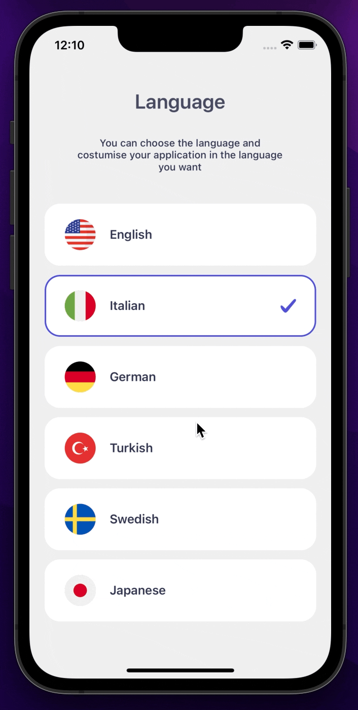

<p align="center">
  
</p>

# Installation

Add the dependency:

```bash
npm i react-native-language-select
```

# Import

```jsx
import LanguagePicker, { ILanguagePicker } from "react-native-language-select";
```

# Example Data

```jsx
const data: ILanguagePicker[] = [
  {
    title: "English",
    imageSource: require("./lib/local-assets/america.png"),
    language: "en",
  },
  {
    title: "Italian",
    imageSource: require("./lib/local-assets/italy.png"),
  },
  {
    title: "German",
    imageSource: require("./lib/local-assets/germany.png"),
  },
  {
    title: "Turkish",
    imageSource: require("./lib/local-assets/turkey.png"),
    language: "tr",
  },
  {
    title: "Swedish",
    imageSource: require("./lib/local-assets/sweden.png"),
  },
  {
    title: "Japanese",
    imageSource: require("./lib/local-assets/japan.png"),
  },
];
```

# Usage

```jsx
<LanguagePicker
  initialIndex={1}
  data={data}
  onSelect={(selectedItem: ILanguagePicker) => {
    onsole.log(selectedItem);
  }}
/>
```

# Configuration - Props

## Fundamentals

| Property |      Type       |  Default  | Description                                 |
| -------- | :-------------: | :-------: | ------------------------------------------- |
| data     | ILanguagePicker | undefined | Language select data                        |
| onSelect |    function     | undefined | select the language item when it is pressed |

## Customization (Optionals)

| Property          |        Type         |               Default               | Description                                             |
| ----------------- | :-----------------: | :---------------------------------: | ------------------------------------------------------- |
| flatListStyle     |        style        |               default               | set or override the style object for the main container |
| containerWidth    | windowWidth \* 0.9  |               number                | set the main container width                            |
| containerHeight   | windowHeight \* 0.7 |               number                | set the main container height                           |
| initialIndex      |       number        |              undefined              | set your selected language item                         |
| width             | windowWidth \* 0.9  |               number                | set the language item width                             |
| height            |         80          |               number                | set the language item height                            |
| backgroundColor   |      '#FFFFFF'      |               string                | set the language item background color                  |
| activeBorderColor |      '#504ED9'      |               strings               | set the language item active item border color          |
| textColor         |      '#2F3452'      |               string                | set to language text                                    |
| itemContainer     |       default       |               default               | change the language item container style                |
| imageComponent    |       default       | React.ReactNode / React.ReactNode[] | change the language image component                     |
| checkComponent    |       default       | React.ReactNode / React.ReactNode[] | change the check component                              |

## Future Plans

- [x] ~~LICENSE~~

## Author

Sevval Eygul, sevvalleygull@gmail.com

## License

React Native Language Select is available under the MIT license. See the LICENSE file for more info.
